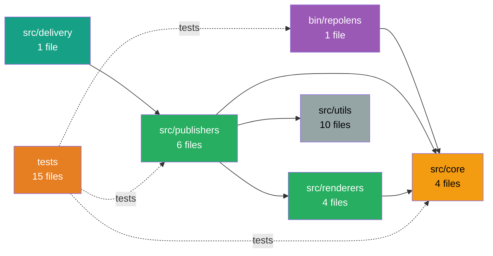

# 🏗️ Architecture & Design

## How RepoLens Works

```
1. SCAN           2. ANALYZE         3. RENDER           4. PUBLISH
──────────────────────────────────────────────────────────────────
Read files   →   Detect tech     →  Generate docs   →   Notion pages
from patterns    stack patterns      with insights       + Confluence pages
                                                         + Markdown files
```

**Scan Phase:**
- Uses `fast-glob` to match your `scan.include` patterns
- Filters out `scan.ignore` patterns
- Reads package.json for framework/tool detection
- Analyzes file paths for Next.js routes, API endpoints

**Analyze Phase:**
- Extracts frameworks (Next.js, React, Vue, Express, etc.)
- Detects build tools (Vite, Webpack, Turbo, esbuild)
- Identifies test frameworks (Vitest, Jest, Playwright)
- Infers module relationships and dependencies

**Render Phase:**
- Groups files into modules based on `module_roots`
- Generates Mermaid diagrams showing module dependencies
- Creates technical profiles with actual stack insights
- Renders Markdown documentation

**Publish Phase:**
- Markdown: Writes files to `.repolens/` directory
- Notion: Creates/updates pages via API with retry logic
- Confluence: Creates/updates pages via REST API v1 (storage format)

## Module Dependency Detection

RepoLens infers relationships by analyzing import patterns:

```typescript
// In src/publishers/notion.js
import { renderSystemOverview } from "../renderers/render.js";
// → Publishers depend on Renderers

// In src/renderers/render.js  
import { scanRepo } from "../core/scan.js";
// → Renderers depend on Core

// Result: Dependency graph shows Publishers → Renderers → Core
```

## System Map



## Project Structure

```
repolens/
├── bin/
│   └── repolens.js          # CLI executable wrapper
├── src/
│   ├── cli.js               # Command orchestration + banner
│   ├── init.js              # Scaffolding command (+ interactive wizard)
│   ├── doctor.js            # Validation command
│   ├── migrate.js           # Workflow migration (legacy → current)
│   ├── watch.js             # Watch mode for local development
│   ├── core/
│   │   ├── config.js        # Config loading + validation
│   │   ├── config-schema.js # Schema version tracking
│   │   ├── diff.js          # Git diff operations
│   │   └── scan.js          # Repository scanning + metadata extraction
│   ├── analyzers/
│   │   ├── domain-inference.js    # Business domain mapping
│   │   ├── context-builder.js     # Structured AI context assembly
│   │   ├── flow-inference.js      # Data flow detection
│   │   ├── graphql-analyzer.js    # GraphQL schema detection
│   │   ├── typescript-analyzer.js # TypeScript type graph analysis
│   │   ├── dependency-graph.js    # Import graph with cycle detection
│   │   └── drift-detector.js      # Architecture drift detection
│   ├── ai/
│   │   ├── provider.js          # Provider-agnostic AI generation
│   │   ├── prompts.js           # Strict prompt templates
│   │   ├── document-plan.js     # Document structure definition
│   │   └── generate-sections.js # AI section generation + fallbacks
│   ├── docs/
│   │   ├── generate-doc-set.js  # Document generation orchestration
│   │   └── write-doc-set.js     # Write docs to disk
│   ├── renderers/
│   │   ├── render.js           # System overview, catalog, API, routes
│   │   ├── renderDiff.js       # Architecture diff rendering
│   │   ├── renderMap.js        # Unicode dependency diagrams
│   │   └── renderAnalysis.js   # Extended analysis renderers
│   ├── publishers/
│   │   ├── index.js         # Publisher orchestration + branch filtering
│   │   ├── publish.js       # Publishing pipeline
│   │   ├── notion.js        # Notion API integration
│   │   ├── confluence.js    # Confluence REST API integration
│   │   ├── github-wiki.js   # GitHub Wiki publisher (git-based)
│   │   └── markdown.js      # Local Markdown generation
│   ├── integrations/
│   │   └── discord.js       # Discord webhook notifications
│   ├── delivery/
│   │   └── comment.js       # PR comment delivery
│   ├── plugins/
│   │   ├── loader.js        # Plugin resolution and dynamic import
│   │   └── manager.js       # Plugin registry and lifecycle orchestration
│   └── utils/
│       ├── logger.js        # Logging utilities
│       ├── retry.js         # API retry logic (exponential backoff)
│       ├── branch.js        # Branch detection (multi-platform)
│       ├── validate.js      # Configuration validation & security
│       ├── metrics.js       # Documentation coverage & health scoring
│       ├── rate-limit.js    # Token bucket rate limiter for APIs
│       ├── secrets.js       # Secret detection & sanitization
│       ├── telemetry.js     # Opt-in error tracking + performance timers
│       ├── errors.js        # Enhanced error messages with guidance
│       └── update-check.js  # Version update notifications
├── tests/                   # Vitest test suite (185 tests across 15 files)
├── .repolens.yml            # Dogfooding config
├── package.json
├── CHANGELOG.md
├── STABILITY.md
├── RELEASE.md
└── ROADMAP.md
```
