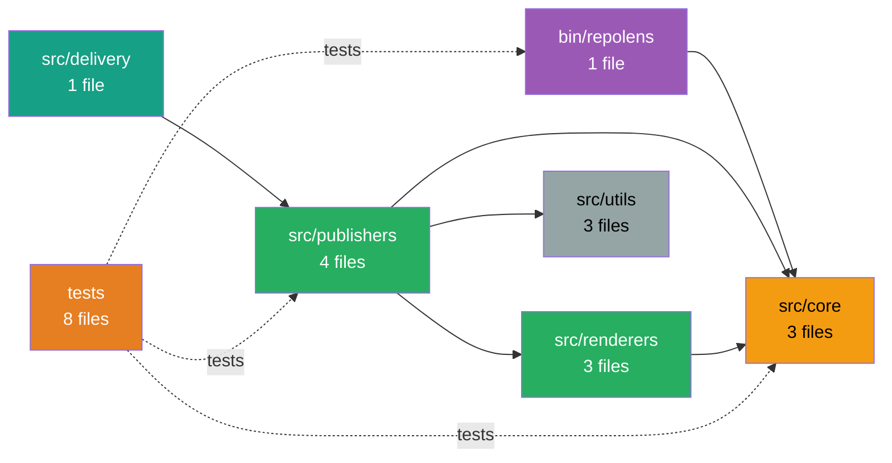

```
    ██████╗ ███████╗██████╗  ██████╗ ██╗     ███████╗███╗   ██╗███████╗
    ██╔══██╗██╔════╝██╔══██╗██╔═══██╗██║     ██╔════╝████╗  ██║██╔════╝
    ██████╔╝█████╗  ██████╔╝██║   ██║██║     █████╗  ██╔██╗ ██║███████╗
    ██╔══██╗██╔══╝  ██╔═══╝ ██║   ██║██║     ██╔══╝  ██║╚██╗██║╚════██║
    ██║  ██║███████╗██║     ╚██████╔╝███████╗███████╗██║ ╚████║███████║
    ╚═╝  ╚═╝╚══════╝╚═╝      ╚═════╝ ╚══════╝╚══════╝╚═╝  ╚═══╝╚══════╝
                        🔍 Repository Intelligence CLI 📊
```

Automated architecture documentation that actually understands your codebase

**Current Status**: v0.3.0 — Production Ready

RepoLens automatically generates and maintains living architecture documentation by analyzing your repository structure, extracting meaningful insights from your package.json, and creating visual dependency graphs. Run it once, or let it auto-update on every push.

⚠️ **Early Access Notice**: The CLI commands and configuration format may evolve until v1.0. We will provide migration guides for any breaking changes. v1.0 will guarantee stable CLI behavior and config schema.

---

## 🚀 Quick Start (60 seconds)

**Step 1: Install**
```bash
npm install github:CHAPIBUNNY/repolens
```

**Step 2: Initialize** (creates config + GitHub Actions workflow)
```bash
npx repolens init
```

**Step 3: Configure Notion** (optional, skip if using Markdown only)
```bash
# Edit .env and add:
NOTION_TOKEN=secret_xxx
NOTION_PARENT_PAGE_ID=xxx
```

**Step 4: Publish**
```bash
npx repolens publish
```

**Done!** Your docs are now live in Notion and/or `.repolens/` directory.

---

---

## 🎯 What RepoLens Does

RepoLens scans your repository and generates comprehensive documentation in seconds:

### 📋 Documentation Pages

| Page | What It Shows | Use Case |
|------|---------------|----------|
| **System Overview** | Tech stack, architecture size, module count | High-level project understanding |
| **Module Catalog** | Complete inventory of all modules | Navigate large codebases |
| **API Surface** | REST endpoints, methods, routes | Backend API documentation |
| **Route Map** | Frontend routes and pages | Frontend navigation structure |
| **System Map** | Visual dependency graph (Mermaid) | Architecture visualization |
| **Architecture Diff** | Changes between commits/branches | PR reviews, change tracking |

### 🔍 Smart Detection

RepoLens automatically detects:
- **Frameworks**: Next.js, React, Vue, Express, NestJS, and more
- **Languages**: TypeScript, JavaScript
- **Build Tools**: Vite, Webpack, Turbo, esbuild
- **Testing**: Vitest, Jest, Playwright, Cypress
- **Module Relationships**: Dependency graphs with actual connections

### ✨ Key Features

✅ **Zero Configuration** - Sensible defaults for common frameworks  
✅ **Auto-Discovery** - Finds `.repolens.yml` automatically in your repo  
✅ **Multiple Publishers** - Output to Notion, Markdown, or both  
✅ **Branch-Aware** - Prevent doc conflicts across branches  
✅ **Update Notifications** - Automatic alerts when new versions are available  
✅ **Visual Diagrams** - Mermaid dependency graphs with optional SVG rendering  
✅ **GitHub Actions** - Autonomous operation on every push  
✅ **PR Comments** - Architecture diffs posted automatically  

---

## 📦 Installation

### Recommended: GitHub Install

```bash
npm install github:CHAPIBUNNY/repolens
```

This installs directly from the latest GitHub commit. Perfect for early access.

### Alternative Methods

<details>
<summary><b>Option B: Local Development</b></summary>

Clone and link for development:

```bash
git clone https://github.com/CHAPIBUNNY/repolens.git
cd repolens
npm link
```
</details>

<details>
<summary><b>Option C: GitHub Release Tarball</b></summary>

Install from a specific version:

```bash
npm install https://github.com/CHAPIBUNNY/repolens/releases/download/v0.2.0/repolens-0.2.0.tgz
```
</details>

<details>
<summary><b>Option D: npm Registry (Coming v1.0)</b></summary>

Once published to npm:

```bash
npm install -g repolens
```
</details>

---

## 🎓 Complete Onboarding Guide

### Step 1: Initialize RepoLens

Run this in your project root:

```bash
npx repolens init
```

**What it creates:**
- `.repolens.yml` — Configuration file
- `.github/workflows/repolens.yml` — Auto-publishing workflow
- `.env.example` — Environment variable template
- `README.repolens.md` — Quick reference guide

**Default configuration works for:**
- Next.js projects
- React applications
- Node.js backends
- Monorepos with common structure

### Step 2: Configure Publishers

Open `.repolens.yml` and verify the `publishers` section:

```yaml
publishers:
  - markdown  # Always works, no setup needed
  - notion    # Requires NOTION_TOKEN and NOTION_PARENT_PAGE_ID
```

**Markdown Only** (simplest):
```yaml
publishers:
  - markdown
```
Documentation lands in `.repolens/` directory. Commit these files or ignore them.

**Notion + Markdown** (recommended):
```yaml
publishers:
  - notion
  - markdown
```
Docs published to Notion for team visibility, plus local Markdown backups.

### Step 3: Set Up Notion Integration (Optional)

If using the Notion publisher:

**3.1: Create Notion Integration**
1. Go to [notion.so/my-integrations](https://www.notion.so/my-integrations)
2. Click **"+ New Integration"**
3. Name it **"RepoLens"**
4. Select your workspace
5. Copy the **Internal Integration Token** (starts with `secret_`)

**3.2: Create Parent Page**
1. Create a new page in Notion (e.g., "📚 Architecture Docs")
2. Click **"..."** menu → **"Add connections"** → Select **"RepoLens"**
3. Copy the page URL: `https://notion.so/workspace/PAGE_ID?xxx`
4. Extract the `PAGE_ID` (32-character hex string)

**3.3: Add Environment Variables**

**For Local Development:**
Create `.env` in your project root:
```bash
NOTION_TOKEN=secret_xxxxxxxxxxxxx
NOTION_PARENT_PAGE_ID=xxxxxxxxxxxxx
NOTION_VERSION=2022-06-28
```

**For GitHub Actions:**
Add as repository secrets:
1. Go to your repo → **Settings** → **Secrets and variables** → **Actions**
2. Click **"New repository secret"**
3. Add:
   - Name: `NOTION_TOKEN`, Value: `secret_xxxxx`
   - Name: `NOTION_PARENT_PAGE_ID`, Value: `xxxxxx`

### Step 4: Configure Branch Publishing (Recommended)

Prevent documentation conflicts by limiting which branches publish to Notion:

```yaml
notion:
  branches:
    - main              # Only main branch publishes
  includeBranchInTitle: false  # Clean titles (no [branch-name] suffix)
```

**Options:**
- `branches: [main]` — Only main publishes (recommended)
- `branches: [main, staging, release/*]` — Multiple branches with glob support
- Omit `branches` entirely — All branches publish (may cause conflicts)

**Markdown publisher always runs on all branches** (local files don't conflict).

### Step 5: Customize Scan Patterns (Optional)

Adjust what files RepoLens scans:

```yaml
scan:
  include:
    - "src/**/*.{ts,tsx,js,jsx}"
    - "app/**/*.{ts,tsx,js,jsx}"
    - "lib/**/*.{ts,tsx,js,jsx}"
  ignore:
    - "node_modules/**"
    - ".next/**"
    - "dist/**"
    - "build/**"

module_roots:
  - "src"
  - "app"
  - "lib"
```

**Performance Note:** RepoLens warns at 10k files and limits at 50k files.

### Step 6: Generate Documentation

Run locally to test:

```bash
npx repolens publish
```

**Expected output:**
```
RepoLens v0.2.0
────────────────────────────────────────
[RepoLens] Using config: /path/to/.repolens.yml
[RepoLens] Loading configuration...
[RepoLens] Scanning repository...
[RepoLens] Detected 42 modules
[RepoLens] Publishing documentation...
[RepoLens] Publishing to Notion from branch: main
[RepoLens] ✓ System Overview published
[RepoLens] ✓ Module Catalog published
[RepoLens] ✓ API Surface published
[RepoLens] ✓ Route Map published
[RepoLens] ✓ System Map published
```

### Step 7: Verify Output

**Markdown Output:**
```bash
ls .repolens/
# system_overview.md
# module_catalog.md
# api_surface.md
# route_map.md
# system_map.md
# diagrams/system_map.svg
```

**Notion Output:**
Open your Notion parent page and verify child pages were created:
- 📊 RepoLens — System Overview
- 📁 RepoLens — Module Catalog
- 🔌 RepoLens — API Surface
- 🗺️ RepoLens — Route Map
- 🏗️ RepoLens — System Map

### Step 8: Enable GitHub Actions (Automatic Updates)

**Commit the workflow:**
```bash
git add .github/workflows/repolens.yml .repolens.yml
git commit -m "Add RepoLens documentation automation"
git push
```

**What happens next:**
- ✅ Every push to `main` regenerates docs
- ✅ Pull requests get architecture diff comments
- ✅ Documentation stays evergreen automatically

**Pro Tip:** Add `.repolens/` to `.gitignore` if you don't want to commit local Markdown files (Notion publisher is your source of truth).

---

## 🎮 Usage Commands

### Publish Documentation

Auto-discovers `.repolens.yml`:
```bash
npx repolens publish
```

Specify config path explicitly:
```bash
npx repolens publish --config /path/to/.repolens.yml
```

Via npm script (add to package.json):
```json
{
  "scripts": {
    "docs": "repolens publish"
  }
}
```

### Validate Setup

Check if your RepoLens setup is valid:

```bash
npx repolens doctor
```

Validates:
- ✅ `.repolens.yml` exists and is valid YAML
- ✅ Required config fields present
- ✅ Publishers configured correctly
- ✅ Scan patterns defined
- ✅ Mermaid CLI installation status

### Get Help

```bash
npx repolens --help
npx repolens --version
```

---

---

## 📸 Example Output

### System Map with Dependencies



### System Overview (Technical Profile)

Generated from your `package.json`:

```markdown
## Technical Profile

**Tech Stack**: Next.js, React  
**Languages**: TypeScript  
**Build Tools**: Vite, Turbo  
**Testing**: Vitest, Playwright  
**Architecture**: Medium-sized modular structure with 42 modules  
**API Coverage**: 18 API endpoints detected  
**UI Pages**: 25 application pages detected  
```

### Architecture Diff in PRs

When you open a pull request, RepoLens posts:

```markdown
## 📐 Architecture Diff

**Modules Changed**: 3
**New Endpoints**: 2
**Routes Modified**: 1

### New API Endpoints
- POST /api/users/:id/verify
- GET /api/users/:id/settings

### Modified Routes
- /dashboard → components/Dashboard.tsx (updated)
```

---

## ⚙️ Configuration Reference

### Complete Example

```yaml
configVersion: 1  # Schema version for future migrations

project:
  name: "my-awesome-app"
  docs_title_prefix: "MyApp"

# Configure output destinations
publishers:
  - notion
  - markdown

# Notion-specific settings (optional)
notion:
  branches:
    - main              # Only main branch publishes
    - staging           # Also staging
    - release/*         # Glob patterns supported
  includeBranchInTitle: false  # Clean titles without [branch-name]

# GitHub integration (optional)
github:
  owner: "your-username"
  repo: "your-repo-name"

# File scanning configuration
scan:
  include:
    - "src/**/*.{ts,tsx,js,jsx}"
    - "app/**/*.{ts,tsx,js,jsx}"
    - "pages/**/*.{ts,tsx,js,jsx}"
    - "lib/**/*.{ts,tsx,js,jsx}"
  ignore:
    - "node_modules/**"
    - ".next/**"
    - "dist/**"
    - "build/**"
    - "coverage/**"

# Module organization
module_roots:
  - "src"
  - "app"
  - "lib"
  - "pages"

# Documentation pages to generate
outputs:
  pages:
    - key: "system_overview"
      title: "System Overview"
      description: "High-level snapshot and tech stack"
    - key: "module_catalog"
      title: "Module Catalog"
      description: "Complete module inventory"
    - key: "api_surface"
      title: "API Surface"
      description: "REST endpoints and methods"
    - key: "route_map"
      title: "Route Map"
      description: "Frontend routes and pages"
    - key: "system_map"
      title: "System Map"
      description: "Visual dependency graph"

# Feature flags (optional, experimental)
features:
  architecture_diff: true
  route_map: true
  visual_diagrams: true
```

### Configuration Fields

| Field | Type | Required | Description |
|-------|------|----------|-------------|
| `configVersion` | number | No | Schema version (current: 1) for future migrations |
| `project.name` | string | Yes | Project name |
| `project.docs_title_prefix` | string | No | Prefix for documentation titles (default: project name) |
| `publishers` | array | Yes | Output targets: `notion`, `markdown` |
| `notion.branches` | array | No | Branch whitelist for Notion publishing. Supports globs. |
| `notion.includeBranchInTitle` | boolean | No | Add `[branch-name]` to titles (default: `true`) |
| `github.owner` | string | No | GitHub org/username for SVG hosting |
| `github.repo` | string | No | Repository name for SVG hosting |
| `scan.include` | array | Yes | Glob patterns for files to scan |
| `scan.ignore` | array | Yes | Glob patterns to exclude |
| `module_roots` | array | No | Root directories for module detection |
| `outputs.pages` | array | Yes | Documentation pages to generate |
| `features` | object | No | Experimental feature flags |

---

## 🔐 Environment Variables

Required for Notion publisher:

| Variable | Required | Description |
|----------|----------|-------------|
| `NOTION_TOKEN` | Yes | Integration token from notion.so/my-integrations |
| `NOTION_PARENT_PAGE_ID` | Yes | Page ID where docs will be created |
| `NOTION_VERSION` | No | API version (default: `2022-06-28`) |

**Local Development:** Create `.env` file in project root  
**GitHub Actions:** Add as repository secrets in Settings → Secrets and variables → Actions

---

## 🏗️ Architecture & Design

### How RepoLens Works

```
1. SCAN           2. ANALYZE         3. RENDER           4. PUBLISH
──────────────────────────────────────────────────────────────────
Read files   →   Detect tech     →  Generate docs   →   Notion pages
from patterns    stack patterns      with insights       + Markdown files
                                                         + SVG diagrams
```

**Scan Phase:**
- Uses `fast-glob` to match your `scan.include` patterns
- Filters out `scan.ignore` patterns
- Reads package.json for framework/tool detection
- Analyzes file paths for Next.js routes, API endpoints

**Analyze Phase:**
- Extracts frameworks (Next.js, React, Vue, Express, etc.)
- Detects build tools (Vite, Webpack, Turbo, esbuild)
- Identifies test frameworks (Vitest, Jest, Playwright)
- Infers module relationships and dependencies

**Render Phase:**
- Groups files into modules based on `module_roots`
- Generates Mermaid diagrams showing module dependencies
- Creates technical profiles with actual stack insights
- Renders Markdown documentation

**Publish Phase:**
- Markdown: Writes files to `.repolens/` directory
- Notion: Creates/updates pages via API with retry logic
- SVG: Generates diagrams with optional mermaid-cli
- Git: Commits diagrams back to repo for GitHub CDN hosting

### Module Dependency Detection

RepoLens infers relationships by analyzing import patterns:

```typescript
// In src/publishers/notion.js
import { renderSystemOverview } from "../renderers/render.js";
// → Publishers depend on Renderers

// In src/renderers/render.js  
import { scanRepo } from "../core/scan.js";
// → Renderers depend on Core

// Result: Dependency graph shows Publishers → Renderers → Core
```

---

---

## 🧪 Development

### Setup

```bash
git clone https://github.com/CHAPIBUNNY/repolens.git
cd repolens
npm install
npm link  # Makes 'repolens' command available globally
```

### Run Tests

```bash
npm test
```

**Test Suite:**
- Config discovery and validation
- Branch detection (GitHub/GitLab/CircleCI)
- Markdown publisher
- Integration workflows
- Doctor command validation

**Coverage:** 32 tests passing

### Test Package Installation Locally

Simulates the full user installation experience:

```bash
# Pack the tarball
npm pack

# Install globally from tarball
npm install -g repolens-0.2.0.tgz

# Verify
repolens --version
```

### Project Structure

```
repolens/
├── bin/
│   └── repolens.js          # CLI executable wrapper
├── src/
│   ├── cli.js               # Command orchestration + banner
│   ├── init.js              # Scaffolding command
│   ├── doctor.js            # Validation command
│   ├── core/
│   │   ├── config.js        # Config loading + validation
│   │   ├── config-schema.js # Schema version tracking
│   │   ├── diff.js          # Git diff operations
│   │   └── scan.js          # Repository scanning + metadata extraction
│   ├── renderers/
│   │   ├── render.js        # System overview, catalog, API, routes
│   │   ├── renderDiff.js    # Architecture diff rendering
│   │   └── renderMap.js     # Mermaid dependency graphs
│   ├── publishers/
│   │   ├── index.js         # Publisher orchestration + branch filtering
│   │   ├── publish.js       # Notion publishing pipeline
│   │   ├── notion.js        # Notion API integration
│   │   └── markdown.js      # Local Markdown generation
│   ├── delivery/
│   │   └── comment.js       # PR comment delivery
│   └── utils/
│       ├── logger.js        # Logging utilities
│       ├── retry.js         # API retry logic
│       ├── branch.js        # Branch detection (multi-platform)
│       └── mermaid.js       # SVG rendering + GitHub URL handling
├── tests/                   # Vitest test suite
├── .repolens.yml            # Dogfooding config
├── package.json
├── CHANGELOG.md
├── RELEASE.md
└── ROADMAP.md
```

---

## 🚀 Release Process

RepoLens uses automated GitHub Actions releases.

### Creating a Release

```bash
# Patch version (0.2.0 → 0.2.1) - Bug fixes
npm run release:patch

# Minor version (0.2.0 → 0.3.0) - New features
npm run release:minor

# Major version (0.2.0 → 1.0.0) - Breaking changes
npm run release:major

# Push the tag to trigger workflow
git push --follow-tags
```

**What happens:**
1. ✅ All tests run
2. ✅ Package tarball created
3. ✅ GitHub Release published
4. ✅ Tarball attached as artifact

See [RELEASE.md](./RELEASE.md) for detailed workflow.

---

## 🤝 Contributing

RepoLens is currently in early access. v1.0 will open for community contributions.

**Ways to help:**
- **Try it out**: Install and use in your projects
- **Report issues**: Share bugs, edge cases, or UX friction
- **Request features**: Tell us what's missing
- **Share feedback**: What works? What doesn't?

---

## 🗺️ Roadmap to v1.0

**Current Status:** v0.2.0 — ~92% production-ready

### Completed ✅

- [x] CLI commands: `init`, `doctor`, `publish`, `version`, `help`
- [x] Config schema v1 with validation
- [x] Auto-discovery of `.repolens.yml`
- [x] Publishers: Notion + Markdown
- [x] Branch-aware publishing with filtering
- [x] Smart tech stack detection from package.json
- [x] Dependency graphs with actual module relationships
- [x] Visual diagrams with optional SVG rendering
- [x] GitHub Actions automation
- [x] PR architecture diff comments
- [x] Performance guardrails (10k warning, 50k limit)
- [x] Comprehensive test suite (32 tests)
- [x] Interactive mermaid-cli installation

### In Progress 🚧

- [ ] Production stability validation
- [ ] Enhanced error messages and debugging
- [ ] Performance optimization for large repos
- [ ] Additional framework detection (Remix, SvelteKit, Astro)

### Planned for v1.0 🎯

- [ ] Plugin system for custom renderers
- [ ] GraphQL schema detection
- [ ] TypeScript type graph analysis
- [ ] Interactive configuration wizard
- [ ] Watch mode for local development
- [ ] npm registry publication

See [ROADMAP.md](./ROADMAP.md) for detailed planning.

---

## 📄 License

MIT

---

## 💬 Support & Contact

- **Issues**: [GitHub Issues](https://github.com/CHAPIBUNNY/repolens/issues)
- **Discussions**: [GitHub Discussions](https://github.com/CHAPIBUNNY/repolens/discussions)
- **Email**: Contact repository maintainers

---

<div align="center">

**Made with 🔍 for developers who care about architecture**

</div>
