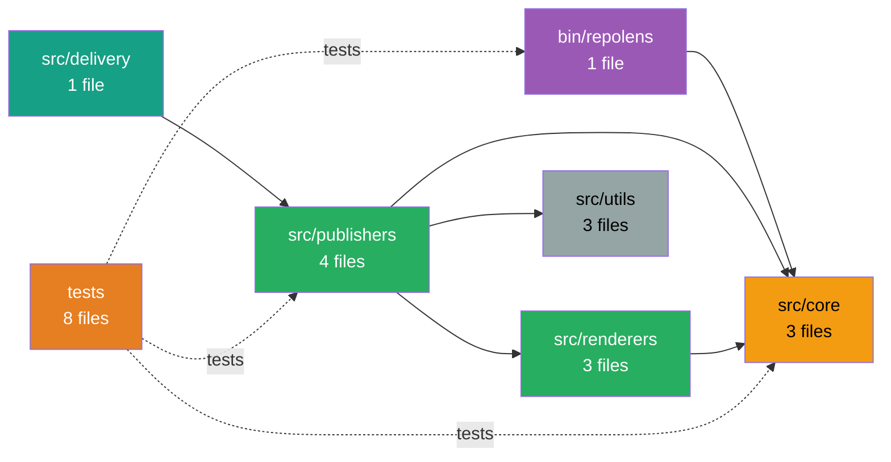

```
    ██████╗ ███████╗██████╗  ██████╗ ██╗     ███████╗███╗   ██╗███████╗
    ██╔══██╗██╔════╝██╔══██╗██╔═══██╗██║     ██╔════╝████╗  ██║██╔════╝
    ██████╔╝█████╗  ██████╔╝██║   ██║██║     █████╗  ██╔██╗ ██║███████╗
    ██╔══██╗██╔══╝  ██╔═══╝ ██║   ██║██║     ██╔══╝  ██║╚██╗██║╚════██║
    ██║  ██║███████╗██║     ╚██████╔╝███████╗███████╗██║ ╚████║███████║
    ╚═╝  ╚═╝╚══════╝╚═╝      ╚═════╝ ╚══════╝╚══════╝╚═╝  ╚═══╝╚══════╝
                        🔍 Repository Intelligence CLI 📊
```

[](https://github.com/CHAPIBUNNY/repolens/actions)
[](SECURITY.md)
[](SECURITY.md)
[](LICENSE)
[](SECURITY.md)

AI-assisted documentation intelligence system that generates architecture docs for engineers AND readable system docs for stakeholders

**Current Status**: v0.6.0 — Confluence Publisher & Team Features

RepoLens automatically generates and maintains living architecture documentation by analyzing your repository structure, extracting meaningful insights from your package.json, and creating visual dependency graphs. Run it once, or let it auto-update on every push.

⚠️ **Early Access Notice**: The CLI commands and configuration format may evolve until v1.0. We will provide migration guides for any breaking changes. v1.0 will guarantee stable CLI behavior and config schema.

---

## 🚀 Quick Start (60 seconds)

**Step 1: Install**
```bash
npm install @chappibunny/repolens
```

**Step 2: Initialize** (creates config + GitHub Actions workflow)
```bash
npx @chappibunny/repolens init
```

**Step 3: Configure Publishing** (optional, skip if using Markdown only)

For Notion:
```bash
# Edit .env and add:
NOTION_TOKEN=secret_xxx
NOTION_PARENT_PAGE_ID=xxx
```

For Confluence:
```bash
# Edit .env and add:
CONFLUENCE_URL=https://your-company.atlassian.net/wiki
CONFLUENCE_EMAIL=your@email.com
CONFLUENCE_API_TOKEN=your-token
CONFLUENCE_SPACE_KEY=DOCS
```

**Step 4: Publish**
```bash
npx @chappibunny/repolens publish
```

**Done!** Your docs are now live in Notion, Confluence, and/or `.repolens/` directory.

**🔄 Upgrading from v0.3.0 or earlier?**
Run `npx @chappibunny/repolens migrate` to automatically update your workflow files. See [MIGRATION.md](MIGRATION.md) for details.

---

---

## 🎯 What RepoLens Does

RepoLens transforms repositories into documented, understandable systems with **AI-assisted documentation intelligence**:

### 🤖 Two Output Modes

**Deterministic Mode (Default)**
- Fast, free, always reliable
- Generates technical documentation from repository structure
- Perfect for code inventories and reference docs

**AI-Enhanced Mode (Optional)**
- Adds natural language explanations and insights
- Creates audience-specific documentation (technical + non-technical)
- Understands business context and data flows
- Provider-agnostic (OpenAI, Anthropic, Azure, local models)

### 📋 Documentation Types

**Non-Technical Documents** (readable by founders, PMs, ops):
- **Executive Summary** — Project overview, capabilities, tech summary
- **Business Domains** — What the system does by functional area
- **Data Flows** — How information moves through the system

**Mixed-Audience Documents** (useful for everyone):
- **System Overview** — Tech stack, scale, module inventory
- **Developer Onboarding** — How to get started contributing
- **Change Impact** — Architecture diff with context

**Technical Documents** (engineers only):
- **Architecture Overview** — Layered technical analysis
- **Module Catalog** — Complete code inventory with patterns
- **API Surface** — REST endpoints, methods, routes
- **Route Map** — Frontend routes and pages
- **System Map** — Visual architecture diagrams

### 🔍 Smart Detection

RepoLens automatically detects:
- **Frameworks**: Next.js, React, Vue, Express, NestJS, and more
- **Languages**: TypeScript, JavaScript  
- **Build Tools**: Vite, Webpack, Turbo, esbuild
- **Testing**: Vitest, Jest, Playwright, Cypress
- **Business Domains**: Authentication, Market Data, Payments, Content, etc.
- **Data Flows**: How information moves through your system
- **Architectural Patterns**: Module relationships and dependencies

### ✨ Key Features

✅ **AI-Assisted Documentation** - Optional AI layer for natural language explanations  
✅ **Multi-Audience Output** - Technical docs for engineers + readable docs for stakeholders  
✅ **Zero Hallucination Policy** - AI receives only structured context, never raw code  
✅ **Provider Agnostic** - Works with any OpenAI-compatible API  
✅ **Deterministic Fallback** - Always generates docs even if AI unavailable  
✅ **Business Domain Inference** - Automatically maps code to business functions  
✅ **Data Flow Analysis** - Understands how information moves through your system  
✅ **Multiple Publishers** - Output to Notion, Confluence, Markdown, or all three  
✅ **Branch-Aware** - Prevent doc conflicts across branches  
✅ **GitHub Actions** - Autonomous operation on every push  
✅ **Team Notifications** - Discord integration with rich embeds (NEW in v0.6.0)  
✅ **Health Score Tracking** - Monitor documentation quality over time (NEW in v0.6.0)  

---

## 👥 Team Features (New in v0.6.0)

### 💬 Discord Notifications

Get notified when documentation changes significantly:

**Features:**
- Rich embeds with coverage, health score, and change percentage
- Threshold-based notifications (only for significant changes)
- Branch filtering with glob pattern support
- Secure webhook configuration via environment variable

**Setup Discord Notifications:**

1. **Create a webhook** in your Discord server:
   - Server Settings → Integrations → Webhooks → New Webhook
   - Copy the webhook URL

2. **Add to environment**:
   ```bash
   # .env (never commit!)
   DISCORD_WEBHOOK_URL=https://discord.com/api/webhooks/xxx/xxx
   ```

3. **Configure in `.repolens.yml`** (optional):
   ```yaml
   discord:
     enabled: true                  # Default: true (if webhook configured)
     notifyOn: significant          # Options: always, significant, never
     significantThreshold: 10       # Notify if change >10% (default)
     branches:                      # Which branches to notify (default: all)
       - main
       - develop
   ```

4. **Add GitHub Actions secret** (for CI/CD):
   - Repo Settings → Secrets and variables → Actions
   - New repository secret: `DISCORD_WEBHOOK_URL`

**Notification includes:**
- Branch and commit information
- Files scanned and modules analyzed
- Coverage percentage and health score
- Change percentage from previous run
- Direct links to Notion and GitHub documentation

---

## 📦 Installation

### Recommended: npm Registry

```bash
npm install @chappibunny/repolens
```

Installs from npm registry. ✨ **Now available in beta!**

### Alternative Methods

<details>
<summary><b>Option B: GitHub Direct Install</b></summary>

Install from the latest GitHub commit:

```bash
npm install github:CHAPIBUNNY/repolens
```
</details>

<details>
<summary><b>Option C: Local Development</b></summary>

Clone and link for development:

```bash
git clone https://github.com/CHAPIBUNNY/repolens.git
cd repolens
npm link
```
</details>

<details>
<summary><b>Option D: GitHub Release Tarball</b></summary>

Install from a specific version:

```bash
npm install https://github.com/CHAPIBUNNY/repolens/releases/download/v0.2.0/repolens-0.2.0.tgz
```
</details>

---

## 🎓 Complete Onboarding Guide

### Step 1: Initialize RepoLens

Run this in your project root:

```bash
npx @chappibunny/repolens init
```

**What it creates:**
- `.repolens.yml` — Configuration file
- `.github/workflows/repolens.yml` — Auto-publishing workflow
- `.env.example` — Environment variable template
- `README.repolens.md` — Quick reference guide

**Default configuration works for:**
- Next.js projects
- React applications
- Node.js backends
- Monorepos with common structure

### Step 2: Configure Publishers

Open `.repolens.yml` and verify the `publishers` section:

```yaml
publishers:
  - markdown    # Always works, no setup needed
  - notion      # Requires NOTION_TOKEN and NOTION_PARENT_PAGE_ID
  - confluence  # Requires CONFLUENCE_URL, CONFLUENCE_EMAIL, CONFLUENCE_API_TOKEN, CONFLUENCE_SPACE_KEY
```

**Markdown Only** (simplest):
```yaml
publishers:
  - markdown
```

**Notion Only**:
```yaml
publishers:
  - notion
```

**Confluence Only**:
```yaml
publishers:
  - confluence
```
Documentation lands in `.repolens/` directory. Commit these files or ignore them.

**Notion + Markdown** (recommended):
```yaml
publishers:
  - notion
  - markdown
```
Docs published to Notion for team visibility, plus local Markdown backups.

**Confluence + Markdown**:
```yaml
publishers:
  - confluence
  - markdown
```
Docs published to Confluence for enterprise teams, plus local Markdown backups.

**All Three**:
```yaml
publishers:
  - notion
  - confluence
  - markdown
```
Maximum visibility: Notion for async collaboration, Confluence for enterprise docs, Markdown for local backups.

### Step 3: Enable AI Features (Optional)

**AI-enhanced documentation adds natural language explanations for non-technical audiences.**

**3.1: Choose an AI Provider**

RepoLens works with any OpenAI-compatible API:
- **OpenAI** (gpt-4-turbo-preview, gpt-3.5-turbo)
- **Anthropic Claude** (via API gateway)
- **Azure OpenAI** (enterprise deployments)
- **Local Models** (Ollama, LM Studio, etc.)

**3.2: Add Environment Variables**

Create `.env` in your project root:
```bash
# Enable AI features
REPOLENS_AI_ENABLED=true
REPOLENS_AI_API_KEY=sk-xxxxxxxxxxxxx

# Optional: Customize provider
REPOLENS_AI_BASE_URL=https://api.openai.com/v1
REPOLENS_AI_MODEL=gpt-4-turbo-preview
REPOLENS_AI_TEMPERATURE=0.3
REPOLENS_AI_MAX_TOKENS=2000
```

**3.3: Configure AI in .repolens.yml**

```yaml
ai:
  enabled: true              # Enable AI features
  mode: hybrid               # hybrid, full, or off
  temperature: 0.3           # Lower = more focused (0.0-1.0)
  max_tokens: 2000           # Token limit per request

features:
  executive_summary: true    # Non-technical overview
  business_domains: true     # Functional area descriptions
  architecture_overview: true # Layered technical analysis
  data_flows: true           # System data flow explanations
  developer_onboarding: true # Getting started guide
  change_impact: true        # Architecture diff with context
```

**Cost Estimates** (with gpt-4-turbo-preview):
- Small repo (<50 files): $0.10-$0.30 per run
- Medium repo (50-200 files): $0.30-$0.80 per run
- Large repo (200+ files): $0.80-$2.00 per run

**For GitHub Actions**, add as repository secret:
- Name: `AI_KEY`, Value: `sk-xxxxx` (your OpenAI API key)

See [AI.md](AI.md) for complete AI documentation and provider setup.

### Step 4: Set Up Notion Integration (Optional)

If using the Notion publisher:

**4.1: Create Notion Integration**
1. Go to [notion.so/my-integrations](https://www.notion.so/my-integrations)
2. Click **"+ New Integration"**
3. Name it **"RepoLens"**
4. Select your workspace
5. Copy the **Internal Integration Token** (starts with `secret_`)

**4.2: Create Parent Page**
1. Create a new page in Notion (e.g., "📚 Architecture Docs")
2. Click **"..."** menu → **"Add connections"** → Select **"RepoLens"**
3. Copy the page URL: `https://notion.so/workspace/PAGE_ID?xxx`
4. Extract the `PAGE_ID` (32-character hex string)

**4.3: Add Environment Variables**

**For Local Development:**
Create `.env` in your project root:
```bash
NOTION_TOKEN=secret_xxxxxxxxxxxxx
NOTION_PARENT_PAGE_ID=xxxxxxxxxxxxx
NOTION_VERSION=2022-06-28
```

**For GitHub Actions:**
Add as repository secrets:
1. Go to your repo → **Settings** → **Secrets and variables** → **Actions**
2. Click **"New repository secret"**
3. Add:
   - Name: `NOTION_TOKEN`, Value: `secret_xxxxx`
   - Name: `NOTION_PARENT_PAGE_ID`, Value: `xxxxxx`

### Step 4a: Set Up Confluence Integration (Optional)

If using the Confluence publisher:

**4a.1: Generate Confluence API Token**
1. Go to [id.atlassian.com/manage-profile/security/api-tokens](https://id.atlassian.com/manage-profile/security/api-tokens)
2. Click **"Create API token"**
3. Name it **"RepoLens"**
4. Copy the generated token (save it securely - you won't see it again!)

**4a.2: Find Your Space Key**
1. Navigate to your Confluence space
2. Go to **Space Settings** → **Space details**
3. Note the **Space Key** (e.g., `DOCS`, `ENG`, `TECH`)

**4a.3: Get Parent Page ID (Optional)**
1. Navigate to the page where you want RepoLens docs nested
2. Click **"..."** menu → **"Page information"**
3. Copy the page ID from the URL: `pageId=123456789`
4. If skipped, docs will be created at space root level

**4a.4: Add Environment Variables**

**For Local Development:**
Create `.env` in your project root:
```bash
CONFLUENCE_URL=https://your-company.atlassian.net/wiki
CONFLUENCE_EMAIL=your@email.com
CONFLUENCE_API_TOKEN=your-api-token-here
CONFLUENCE_SPACE_KEY=DOCS
CONFLUENCE_PARENT_PAGE_ID=123456789  # Optional
```

**For Confluence Server/Data Center** (self-hosted):
```bash
CONFLUENCE_URL=https://confluence.yourcompany.com
CONFLUENCE_EMAIL=your-username  # Use username instead of email
CONFLUENCE_API_TOKEN=your-personal-access-token
CONFLUENCE_SPACE_KEY=DOCS
CONFLUENCE_PARENT_PAGE_ID=123456789  # Optional
```

**For GitHub Actions:**
Add as repository secrets:
1. Go to your repo → **Settings** → **Secrets and variables** → **Actions**
2. Click **"New repository secret"**
3. Add:
   - Name: `CONFLUENCE_URL`, Value: `https://your-company.atlassian.net/wiki`
   - Name: `CONFLUENCE_EMAIL`, Value: `your@email.com`
   - Name: `CONFLUENCE_API_TOKEN`, Value: `your-token`
   - Name: `CONFLUENCE_SPACE_KEY`, Value: `DOCS`
   - Name: `CONFLUENCE_PARENT_PAGE_ID`, Value: `123456789` (optional)

**Confluence + Notion + Markdown** (all three!):
```yaml
publishers:
  - markdown
  - notion
  - confluence
```

Docs published to both Notion and Confluence for maximum visibility!

### Step 5: Configure Branch Publishing (Recommended)

Prevent documentation conflicts by limiting which branches publish to Notion/Confluence:

```yaml
notion:
  branches:
    - main              # Only main branch publishes
  includeBranchInTitle: false  # Clean titles (no [branch-name] suffix)

confluence:
  branches:
    - main              # Only main branch publishes to Confluence
```

**Options:**
- `branches: [main]` — Only main publishes (recommended)
- `branches: [main, staging, release/*]` — Multiple branches with glob support
- Omit `branches` entirely — All branches publish (may cause conflicts)

**Markdown publisher always runs on all branches** (local files don't conflict).

### Step 6: Customize Scan Patterns (Optional)

Adjust what files RepoLens scans:

```yaml
scan:
  include:
    - "src/**/*.{ts,tsx,js,jsx}"
    - "app/**/*.{ts,tsx,js,jsx}"
    - "lib/**/*.{ts,tsx,js,jsx}"
  ignore:
    - "node_modules/**"
    - ".next/**"
    - "dist/**"
    - "build/**"

module_roots:
  - "src"
  - "app"
  - "lib"
```

**Performance Note:** RepoLens warns at 10k files and limits at 50k files.

### Step 7: Generate Documentation

Run locally to test:

```bash
npx @chappibunny/repolens publish
```

**Expected output:**
```
RABITAI 🐰
────────────────────────────────────────────────────
[RepoLens] Using config: /path/to/.repolens.yml
[RepoLens] Loading configuration...
[RepoLens] Scanning repository...
[RepoLens] Detected 42 modules
[RepoLens] Publishing documentation...
[RepoLens] Publishing to Notion from branch: main
[RepoLens] ✓ System Overview published
[RepoLens] ✓ Module Catalog published
[RepoLens] ✓ API Surface published
[RepoLens] ✓ Route Map published
[RepoLens] ✓ System Map published
```

### Step 8: Verify Output

**Markdown Output:****
```bash
ls .repolens/
# system_overview.md
# module_catalog.md
# api_surface.md
# route_map.md
# system_map.md
# diagrams/system_map.svg
```

**Notion Output:**
Open your Notion parent page and verify child pages were created:
- 📊 RepoLens — Executive Summary (if AI enabled)
- 📈 RepoLens — Business Domains (if AI enabled)
- 📊 RepoLens — System Overview
- 📚 RepoLens — Developer Onboarding (if AI enabled)
- 📊 RepoLens — Architecture Overview (if AI enabled)
- 📊 RepoLens — Data Flows (if AI enabled)
- 📌 RepoLens — Module Catalog
- 🔌 RepoLens — API Surface
- 🗺️ RepoLens — Route Map
- 🏛️ RepoLens — System Map

### Step 9: Enable GitHub Actions (Automatic Updates)

**Commit the workflow:**
```bash
git add .github/workflows/repolens.yml .repolens.yml
git commit -m "Add RepoLens documentation automation"
git push
```

**What happens next:**
- ✅ Every push to `main` regenerates docs
- ✅ Pull requests get architecture diff comments
- ✅ Documentation stays evergreen automatically

**Pro Tip:** Add `.repolens/` to `.gitignore` if you don't want to commit local Markdown files (Notion publisher is your source of truth).

---

## 🎮 Usage Commands

### Publish Documentation

Auto-discovers `.repolens.yml`:
```bash
npx @chappibunny/repolens publish
```

Specify config path explicitly:
```bash
npx @chappibunny/repolens publish --config /path/to/.repolens.yml
```

Via npm script (add to package.json):
```json
{
  "scripts": {
    "docs": "repolens publish"
  }
}
```

### Validate Setup

Check if your RepoLens setup is valid:

```bash
npx @chappibunny/repolens doctor
```

Validates:
- ✅ `.repolens.yml` exists and is valid YAML
- ✅ Required config fields present
- ✅ Publishers configured correctly
- ✅ Scan patterns defined
- ✅ Mermaid CLI installation status

### Migrate Workflows

**🚨 Upgrading from v0.3.0 or earlier?** Automatically update your GitHub Actions workflows:

```bash
npx @chappibunny/repolens migrate
```

Preview changes without applying:
```bash
npx @chappibunny/repolens migrate --dry-run
```

What it fixes:
- ❌ Removes outdated `cd tools/repolens` commands
- ✅ Updates to `npx @chappibunny/repolens@latest publish`
- ✅ Adds Node.js setup step if missing
- ✅ Adds environment variables (NOTION_TOKEN, REPOLENS_AI_API_KEY)
- 💾 Creates backup files for safety

**Common error it fixes:**
```
Run cd tools/repolens
cd: tools/repolens: No such file or directory
Error: Process completed with exit code 1.
```

See [MIGRATION.md](MIGRATION.md) for detailed upgrade guide.

### Get Help

```bash
npx @chappibunny/repolens --help
npx @chappibunny/repolens --version
```

---

---

## 📸 Example Output

### System Map with Dependencies



### System Overview (Technical Profile)

Generated from your `package.json`:

```markdown
## Technical Profile

**Tech Stack**: Next.js, React  
**Languages**: TypeScript  
**Build Tools**: Vite, Turbo  
**Testing**: Vitest, Playwright  
**Architecture**: Medium-sized modular structure with 42 modules  
**API Coverage**: 18 API endpoints detected  
**UI Pages**: 25 application pages detected  
```

### Architecture Diff in PRs

When you open a pull request, RepoLens posts:

```markdown
## 📐 Architecture Diff

**Modules Changed**: 3
**New Endpoints**: 2
**Routes Modified**: 1

### New API Endpoints
- POST /api/users/:id/verify
- GET /api/users/:id/settings

### Modified Routes
- /dashboard → components/Dashboard.tsx (updated)
```

---

## 🔒 Privacy & Telemetry

RepoLens includes **opt-in** error tracking and usage telemetry to help improve reliability, understand adoption patterns, and prioritize features.

**Privacy First:**
- ✅ **Disabled by default** - telemetry is opt-in
- ✅ **No code collection** - your source code never leaves your machine
- ✅ **No secrets** - API keys and tokens are never sent
- ✅ **Anonymous** - no personal information or repository names
- ✅ **Transparent** - see exactly what data is collected

**To enable telemetry**, add to `.env`:
```bash
REPOLENS_TELEMETRY_ENABLED=true
```

**What's collected (when enabled):**

*Error Tracking (Phase 1):*
- Error messages and stack traces (for debugging)
- Command that failed (e.g., `publish`, `migrate`)
- Basic system info (Node version, platform)

*Usage Metrics (Phase 2):*
- Command execution times (scan, render, publish)
- Repository size (file count, module count)
- Feature usage (AI enabled, publishers used)
- Success/failure rates

**Why enable it?**
- 🐛 **Faster bug fixes** - issues you encounter are fixed proactively
- 📊 **Better features** - development focused on real-world usage
- ⚡ **Performance** - optimizations based on actual bottlenecks
- 🎯 **Prioritization** - roadmap guided by community needs

For full details and example data, see [TELEMETRY.md](TELEMETRY.md).

---

## 🛡️ Security

RepoLens implements **defense-in-depth** security to protect your credentials, code, and infrastructure.

### Security Architecture (Phase 3)

**Layer 1: Input Validation** (`src/utils/validate.js`)
- ✅ Schema validation with required field enforcement
- ✅ Injection attack detection (shell, command substitution)
- ✅ Directory traversal prevention (`..`, absolute paths, null bytes)
- ✅ Secret scanning in configuration files
- ✅ Circular reference protection (depth limit: 20 levels)

**Layer 2: Secret Detection** (`src/utils/secrets.js`)
- ✅ **15+ credential patterns**: OpenAI, GitHub, AWS, Notion, Generic API keys
- ✅ **Entropy-based detection**: High-entropy strings (Shannon entropy > 4.5)
- ✅ **Automatic sanitization**: All logger output, telemetry, error messages
- ✅ **Format**: `sk-abc123xyz` → `sk-ab***yz` (first 2 + last 2 chars visible)

**Layer 3: Rate Limiting** (`src/utils/rate-limit.js`)
- ✅ **Token bucket algorithm**: 3 requests/second for Notion & AI APIs
- ✅ **Exponential backoff**: Automatic retry with jitter (500ms → 1s → 2s)
- ✅ **Cost protection**: Prevents runaway API usage
- ✅ **Retryable errors**: 429, 500, 502, 503, 504, network timeouts

**Layer 4: Supply Chain Security**
- ✅ **Action pinning**: GitHub Actions pinned to commit SHAs (not tags)
- ✅ **Minimal permissions**: `contents: read` or `contents: write` only
- ✅ **Dependency audits**: CI/CD fails on critical/high vulnerabilities
- ✅ **npm audit**: 0 vulnerabilities in 519 dependencies

**Layer 5: Comprehensive Testing**
- ✅ **43 security tests**: Fuzzing, injection, boundary conditions
- ✅ **Attack vectors tested**: SQL, command, path, YAML, NoSQL, LDAP, XML
- ✅ **90 total tests**: 47 functional + 43 security (100% passing)

### Security Validation (Automatic)

```bash
# Every configuration load:
✅ No injection patterns detected (;|&`$())
✅ No secrets in configuration files
✅ Safe path patterns only (no .. or absolute paths)
✅ Valid schema (configVersion: 1)

# Every runtime operation:
✅ All logs sanitized (secrets redacted)
✅ Telemetry sanitized (no credentials sent)
✅ Rate limiting active (3 req/sec)
✅ Type validation active (prevents type confusion)

# Every CI/CD run:
✅ npm audit passing (0 vulnerabilities)
✅ Security tests passing (43/43)
✅ Secrets scanner passing (no hardcoded credentials)
```

### Vulnerability Reporting

- 📧 **Email**: [your-email@example.com] (replace with actual contact)
- 🚨 **DO NOT** open public issues for security bugs
- ⏱️ **Response**: Within 48 hours
- 🔒 **Fix Timeline**: Critical issues within 7 days, others within 30 days
- 📢 **Disclosure**: Coordinated disclosure after fix is released

### Security Best Practices

**✅ DO:**
- Store secrets in GitHub Secrets (not `.repolens.yml`)
- Use environment variables for sensitive data
- Review generated documentation before publishing
- Enable telemetry to catch security issues early
- Run `npm audit` regularly
- Pin workflows to specific versions

**❌ DON'T:**
- Commit API keys to version control
- Share `.env` files publicly
- Disable security validation
- Use overly broad scan patterns (`**/*`)
- Ignore security warnings

For complete security documentation and threat model, see [SECURITY.md](SECURITY.md).

---

## ⚙️ Configuration Reference

### Complete Example

```yaml
configVersion: 1  # Schema version for future migrations

project:
  name: "my-awesome-app"
  docs_title_prefix: "MyApp"

# Configure output destinations
publishers:
  - notion
  - markdown

# Notion-specific settings (optional)
notion:
  branches:
    - main              # Only main branch publishes
    - staging           # Also staging
    - release/*         # Glob patterns supported
  includeBranchInTitle: false  # Clean titles without [branch-name]

# Discord notifications (optional, new in v0.6.0)
discord:
  enabled: true                  # Default: true (if DISCORD_WEBHOOK_URL set)
  notifyOn: significant          # Options: always, significant, never
  significantThreshold: 10       # Notify if change >10% (default)
  branches:                      # Which branches to notify (default: all)
    - main
    - develop

# GitHub integration (optional)
github:
  owner: "your-username"
  repo: "your-repo-name"

# File scanning configuration
scan:
  include:
    - "src/**/*.{ts,tsx,js,jsx}"
    - "app/**/*.{ts,tsx,js,jsx}"
    - "pages/**/*.{ts,tsx,js,jsx}"
    - "lib/**/*.{ts,tsx,js,jsx}"
  ignore:
    - "node_modules/**"
    - ".next/**"
    - "dist/**"
    - "build/**"
    - "coverage/**"

# Module organization
module_roots:
  - "src"
  - "app"
  - "lib"
  - "pages"

# Documentation pages to generate
outputs:
  pages:
    - key: "system_overview"
      title: "System Overview"
      description: "High-level snapshot and tech stack"
    - key: "module_catalog"
      title: "Module Catalog"
      description: "Complete module inventory"
    - key: "api_surface"
      title: "API Surface"
      description: "REST endpoints and methods"
    - key: "route_map"
      title: "Route Map"
      description: "Frontend routes and pages"
    - key: "system_map"
      title: "System Map"
      description: "Visual dependency graph"

# Feature flags (optional, experimental)
features:
  architecture_diff: true
  route_map: true
  visual_diagrams: true
```

### Configuration Fields

| Field | Type | Required | Description |
|-------|------|----------|-------------|
| `configVersion` | number | No | Schema version (current: 1) for future migrations |
| `project.name` | string | Yes | Project name |
| `project.docs_title_prefix` | string | No | Prefix for documentation titles (default: project name) |
| `publishers` | array | Yes | Output targets: `notion`, `markdown` |
| `notion.branches` | array | No | Branch whitelist for Notion publishing. Supports globs. |
| `notion.includeBranchInTitle` | boolean | No | Add `[branch-name]` to titles (default: `true`) |
| `discord.enabled` | boolean | No | Enable Discord notifications (default: `true` if webhook set) |
| `discord.notifyOn` | string | No | Notification policy: `always`, `significant`, `never` (default: `significant`) |
| `discord.significantThreshold` | number | No | Change % threshold for notifications (default: `10`) |
| `discord.branches` | array | No | Branch filter for notifications. Supports globs. (default: all) |
| `github.owner` | string | No | GitHub org/username for SVG hosting |
| `github.repo` | string | No | Repository name for SVG hosting |
| `scan.include` | array | Yes | Glob patterns for files to scan |
| `scan.ignore` | array | Yes | Glob patterns to exclude |
| `module_roots` | array | No | Root directories for module detection |
| `outputs.pages` | array | Yes | Documentation pages to generate |
| `features` | object | No | Experimental feature flags |

---

## 🔐 Environment Variables

Required for Notion publisher:

| Variable | Required | Description |
|----------|----------|-------------|
| `NOTION_TOKEN` | Yes | Integration token from notion.so/my-integrations |
| `NOTION_PARENT_PAGE_ID` | Yes | Page ID where docs will be created |
| `NOTION_VERSION` | No | API version (default: `2022-06-28`) |

Optional for Discord notifications (new in v0.6.0):

| Variable | Required | Description |
|----------|----------|-------------|
| `DISCORD_WEBHOOK_URL` | No | Discord webhook URL for team notifications |

**Local Development:** Create `.env` file in project root  
**GitHub Actions:** Add as repository secrets in Settings → Secrets and variables → Actions

---

## 🏗️ Architecture & Design

### How RepoLens Works

```
1. SCAN           2. ANALYZE         3. RENDER           4. PUBLISH
──────────────────────────────────────────────────────────────────
Read files   →   Detect tech     →  Generate docs   →   Notion pages
from patterns    stack patterns      with insights       + Markdown files
                                                         + SVG diagrams
```

**Scan Phase:**
- Uses `fast-glob` to match your `scan.include` patterns
- Filters out `scan.ignore` patterns
- Reads package.json for framework/tool detection
- Analyzes file paths for Next.js routes, API endpoints

**Analyze Phase:**
- Extracts frameworks (Next.js, React, Vue, Express, etc.)
- Detects build tools (Vite, Webpack, Turbo, esbuild)
- Identifies test frameworks (Vitest, Jest, Playwright)
- Infers module relationships and dependencies

**Render Phase:**
- Groups files into modules based on `module_roots`
- Generates Mermaid diagrams showing module dependencies
- Creates technical profiles with actual stack insights
- Renders Markdown documentation

**Publish Phase:**
- Markdown: Writes files to `.repolens/` directory
- Notion: Creates/updates pages via API with retry logic
- SVG: Generates diagrams with optional mermaid-cli
- Git: Commits diagrams back to repo for GitHub CDN hosting

### Module Dependency Detection

RepoLens infers relationships by analyzing import patterns:

```typescript
// In src/publishers/notion.js
import { renderSystemOverview } from "../renderers/render.js";
// → Publishers depend on Renderers

// In src/renderers/render.js  
import { scanRepo } from "../core/scan.js";
// → Renderers depend on Core

// Result: Dependency graph shows Publishers → Renderers → Core
```

---

---

## 🧪 Development

### Setup

```bash
git clone https://github.com/CHAPIBUNNY/repolens.git
cd repolens
npm install
npm link  # Makes 'repolens' command available globally
```

### Run Tests

```bash
npm test
```

**Test Suite:**
- Config discovery and validation
- Branch detection (GitHub/GitLab/CircleCI)
- Markdown publisher
- Integration workflows
- Doctor command validation

**Coverage:** 32 tests passing

### Test Package Installation Locally

Simulates the full user installation experience:

```bash
# Pack the tarball
npm pack

# Install globally from tarball
npm install -g repolens-0.2.0.tgz

# Verify
repolens --version
```

### Project Structure

```
repolens/
├── bin/
│   └── repolens.js          # CLI executable wrapper
├── src/
│   ├── cli.js               # Command orchestration + banner
│   ├── init.js              # Scaffolding command
│   ├── doctor.js            # Validation command
│   ├── core/
│   │   ├── config.js        # Config loading + validation
│   │   ├── config-schema.js # Schema version tracking
│   │   ├── diff.js          # Git diff operations
│   │   └── scan.js          # Repository scanning + metadata extraction
│   ├── renderers/
│   │   ├── render.js        # System overview, catalog, API, routes
│   │   ├── renderDiff.js    # Architecture diff rendering
│   │   └── renderMap.js     # Mermaid dependency graphs
│   ├── publishers/
│   │   ├── index.js         # Publisher orchestration + branch filtering
│   │   ├── publish.js       # Notion publishing pipeline
│   │   ├── notion.js        # Notion API integration
│   │   └── markdown.js      # Local Markdown generation
│   ├── delivery/
│   │   └── comment.js       # PR comment delivery
│   └── utils/
│       ├── logger.js        # Logging utilities
│       ├── retry.js         # API retry logic
│       ├── branch.js        # Branch detection (multi-platform)
│       └── mermaid.js       # SVG rendering + GitHub URL handling
├── tests/                   # Vitest test suite
├── .repolens.yml            # Dogfooding config
├── package.json
├── CHANGELOG.md
├── RELEASE.md
└── ROADMAP.md
```

---

## 🚀 Release Process

RepoLens uses automated GitHub Actions releases.

### Creating a Release

```bash
# Patch version (0.2.0 → 0.2.1) - Bug fixes
npm run release:patch

# Minor version (0.2.0 → 0.3.0) - New features
npm run release:minor

# Major version (0.2.0 → 1.0.0) - Breaking changes
npm run release:major

# Push the tag to trigger workflow
git push --follow-tags
```

**What happens:**
1. ✅ All tests run
2. ✅ Package tarball created
3. ✅ GitHub Release published
4. ✅ Tarball attached as artifact

See [RELEASE.md](./RELEASE.md) for detailed workflow.

---

## 🤝 Contributing

RepoLens is currently in early access. v1.0 will open for community contributions.

**Ways to help:**
- **Try it out**: Install and use in your projects
- **Report issues**: Share bugs, edge cases, or UX friction
- **Request features**: Tell us what's missing
- **Share feedback**: What works? What doesn't?

---

## 🗺️ Roadmap to v1.0

**Current Status:** v0.2.0 — ~92% production-ready

### Completed ✅

- [x] CLI commands: `init`, `doctor`, `publish`, `version`, `help`
- [x] Config schema v1 with validation
- [x] Auto-discovery of `.repolens.yml`
- [x] Publishers: Notion + Markdown
- [x] Branch-aware publishing with filtering
- [x] Smart tech stack detection from package.json
- [x] Dependency graphs with actual module relationships
- [x] Visual diagrams with optional SVG rendering
- [x] GitHub Actions automation
- [x] PR architecture diff comments
- [x] Performance guardrails (10k warning, 50k limit)
- [x] Comprehensive test suite (32 tests)
- [x] Interactive mermaid-cli installation

### In Progress 🚧

- [ ] Production stability validation
- [ ] Enhanced error messages and debugging
- [ ] Performance optimization for large repos
- [ ] Additional framework detection (Remix, SvelteKit, Astro)

### Planned for v1.0 🎯

- [ ] Plugin system for custom renderers
- [ ] GraphQL schema detection
- [ ] TypeScript type graph analysis
- [ ] Interactive configuration wizard
- [ ] Watch mode for local development
- [ ] npm registry publication

See [ROADMAP.md](./ROADMAP.md) for detailed planning.

---

## 📄 License

MIT

---

## 💬 Support & Contact

- **Issues**: [GitHub Issues](https://github.com/CHAPIBUNNY/repolens/issues)
- **Discussions**: [GitHub Discussions](https://github.com/CHAPIBUNNY/repolens/discussions)
- **Email**: Contact repository maintainers

---

<div align="center">

**Made with RABITAI for developers who care about architecture**

</div>
