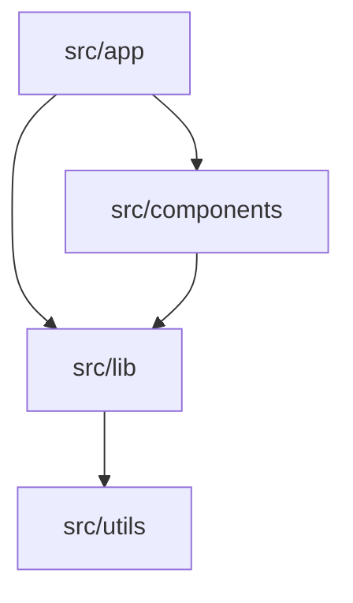

# RepoLens

> Automated architecture documentation for your repository

RepoLens automatically generates and maintains architecture documentation, detecting your system structure, API surfaces, routes, and tracking architectural changes over time.

## Quick Start

```bash
# Install from GitHub
npm install github:CHAPIBUNNY/repolens

# Initialize in your repo
npx repolens init

# Publish documentation
npx repolens publish
```

## What RepoLens Does

RepoLens scans your repository and generates comprehensive documentation:

- **System Overview** - High-level snapshot of your architecture
- **Module Catalog** - Complete inventory of all modules and their relationships
- **API Surface** - Detected REST endpoints, GraphQL schemas, RPC definitions
- **Route Map** - Frontend routes with component associations
- **System Map** - Visual Mermaid diagram of module dependencies
- **Architecture Diff** - Track architectural changes in pull requests

## Features

✅ **Autonomous Operation** - Runs automatically via GitHub Actions  
✅ **Config Auto-Discovery** - Finds `.repolens.yml` automatically  
✅ **Multiple Publishers** - Outputs to Notion, Markdown, or both  
✅ **PR Comments** - Posts architecture diffs to pull requests  
✅ **Zero Configuration Start** - Sensible defaults for common frameworks  

## Installation

### Option A: GitHub Install (Recommended)

```bash
npm install github:CHAPIBUNNY/repolens
```

Then use globally:

```bash
npx repolens init
```

### Option B: Local Development

Clone the repository:

```bash
git clone https://github.com/CHAPIBUNNY/repolens.git
cd repolens
npm link
```

### Option C: GitHub Release Tarball

```bash
npm install https://github.com/CHAPIBUNNY/repolens/releases/download/v0.1.1/repolens-0.1.1.tgz
```

### Option D: npm Registry (Coming Soon)

Once published to npm:

```bash
npm install -g repolens
npx repolens init
```

## Usage

### Initialize a Repository

Set up RepoLens in your project:

```bash
repolens init
```

This creates:
- `.repolens.yml` - Configuration file
- `.github/workflows/repolens.yml` - GitHub Actions workflow
- `.env.example` - Environment variable template
- `README.repolens.md` - Onboarding guide

### Validate Setup

Check if a repository has valid RepoLens configuration:

```bash
repolens doctor --target /path/to/repo
```

Validates:
- Required files exist (`.repolens.yml`, workflow)
- Configuration is valid YAML
- Publishers are configured
- Scan patterns are defined

### Publish Documentation

Scan repository and publish to configured outputs:

```bash
# Auto-discovers .repolens.yml in current or parent directories
repolens publish

# Or specify config explicitly
repolens publish --config /path/to/.repolens.yml

# Or use npm script (from repository root)
npm run repolens
```

**Automatic Publishing**: RepoLens runs automatically via GitHub Actions on every push to main and on pull requests.

### Version & Help

```bash
repolens --version
repolens --help
```

## Example Output

After running `repolens publish`, you'll get:

```
.repolens/
├── system_overview.md      # High-level architecture snapshot
├── module_catalog.md       # Complete module inventory
├── api_surface.md          # REST/GraphQL/RPC endpoints
├── route_map.md            # Frontend routes and components
└── system_map.md           # Mermaid dependency diagram
```

### System Map Example



### Architecture Diff Example

When you open a PR, RepoLens posts a comment:

```markdown
## 📐 Architecture Diff

**Modules Changed**: 3
**New Endpoints**: 2
**Routes Modified**: 1

### New API Endpoints
- POST /api/users/:id/verify
- GET /api/users/:id/settings

### Modified Routes
- /dashboard → components/Dashboard.tsx (updated)
```

## Configuration

Example `.repolens.yml`:

```yaml
project:
  name: "my-project"
  docs_title_prefix: "RepoLens"

publishers:
  - notion
  - markdown

scan:
  include:
    - "src/**/*.{ts,tsx,js,jsx,md}"
    - "app/**/*.{ts,tsx,js,jsx,md}"
  ignore:
    - "node_modules/**"
    - ".next/**"
    - "dist/**"

module_roots:
  - "src/app"
  - "src/components"
  - "src/lib"

outputs:
  pages:
    - key: "system_overview"
      title: "System Overview"
      description: "High-level snapshot of the repo"
```

## Environment Variables

Required for Notion publisher:

```bash
NOTION_TOKEN=secret_...
NOTION_PARENT_PAGE_ID=...
NOTION_VERSION=2022-06-28
```

## Development

### Run Tests

```bash
npm test
```

### Test Tarball Installation

Tests the complete package lifecycle (pack → install → verify):

```bash
npm run test:install
```

This simulates what happens when users install from npm or a tarball.

### Test Package Locally

```bash
npm pack
npm install -g repolens-0.1.1.tgz
repolens --version
```

### Project Structure

```
tools/repolens/
├── bin/
│   └── repolens.js          # CLI executable wrapper
├── src/
│   ├── cli.js               # Main CLI entry point
│   ├── init.js              # Init command
│   ├── doctor.js            # Validation command
│   ├── core/                # Core scanning & diffing
│   ├── renderers/           # Documentation renderers
│   ├── publishers/          # Output publishers
│   ├── delivery/            # PR comment delivery
│   └── utils/               # Shared utilities
├── tests/                   # Test suite
├── package.json
├── CHANGELOG.md
└── RELEASE.md
```

## Release Process

RepoLens uses automated releases via GitHub Actions.

### Creating a Release

```bash
# For patch version (0.1.1 → 0.1.2)
npm run release:patch

# For minor version (0.1.1 → 0.2.0)
npm run release:minor

# For major version (0.1.1 → 1.0.0)
npm run release:major

# Push the tag to trigger release workflow
git push --follow-tags
```

The GitHub Actions workflow will:
1. Run all tests
2. Build the package
3. Create a GitHub release
4. Attach the tarball artifact

See [RELEASE.md](./RELEASE.md) for detailed release workflow.

## GitHub Actions Integration

RepoLens automatically generates a GitHub Actions workflow that:

1. Runs on push to `main` and pull request events
2. Scans repository structure and generates documentation
3. Publishes to configured outputs (Notion, Markdown)
4. Posts architecture diff summary as PR comment

Required repository secrets:
- `NOTION_TOKEN`
- `NOTION_PARENT_PAGE_ID`

## License

MIT

## Contributing

RepoLens is currently a private tool. For issues or questions, contact the repository maintainers.
